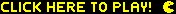

# Pac-Man 

This solo project is an imitation of the classic 1980 Namco game, Pac-Man. Players can visit the Heroku URL and enter their name. Upon which the game will load with similar rules to the original Pac-Man where the player has to collect as many pellets as they can while avoiding the ghosts that roam the board. This project connects to a MongoDB Atlas database which saves the players score when all their lives run out and the game is over. After which, the leaderboard of the top ten scores are pulled from the database and displayed on the page where the player can see how well they did.

### Tech Used:

- [Miro](https://miro.com/index/) for planning the layout (Board can be found [here](https://miro.com/app/board/uXjVOo0XLMk=/?share_link_id=344912241548))
- [Trello](https://trello.com/) for monitoring feature progress
- [Mongoose](https://mongoosejs.com/docs/) for Object Data Modelling (ODM)
- [Express](https://expressjs.com/) for setting up a backend server
- [React](https://reactjs.org/) for frontend development
- [Node.js](https://nodejs.org/en/) for the backend runtime environment
- [MongoDB Atlas](https://www.mongodb.com/atlas/database) to store the database
- [Jest](https://jestjs.io/) for testing
- [Heroku](https://www.heroku.com/) for deployment
- [Pexels Draw](https://apps.apple.com/us/app/pexels-draw/id1320744895?mt=12) for creating the boundary images and ghost sprites
- [HTML Canvas](https://www.w3schools.com/html/html5_canvas.asp) for a container for the graphics
- [GitHub](https://github.com/) for storing the code and running Continuous Integreation (CI) in GitHub Actions

## Running Locally

### Setup

### How to Use

## Rules

## Features Pending

## Getting Started with Create React App

This project was bootstrapped with [Create React App](https://github.com/facebook/create-react-app).
