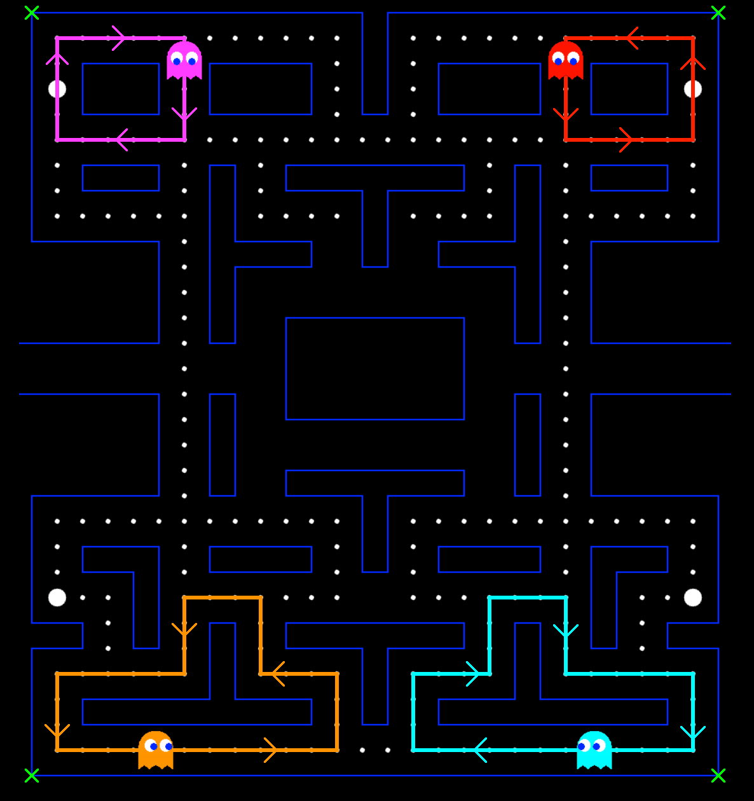
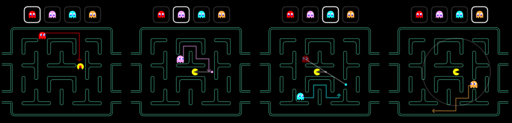

# Pac-Man     &nbsp;&nbsp;&nbsp;&nbsp;&nbsp;&nbsp; 

This solo project is an imitation of the classic 1980 Namco game, Pac-Man. Players can visit the live site and enter their name. Upon which the game will load with similar rules to the original Pac-Man where the player has to score as many points as they can while avoiding the ghosts that roam the board. This webapp connects to a MongoDB Atlas database which saves the players score when all their lives run out and the game is over. After which, the leaderboard of the top ten scores are pulled from the database and displayed on the page where the player can see how well they did.

[](https://pacman-clone.herokuapp.com/)

### Technologies Used

- [Miro](https://miro.com/index/) for planning the layout (Board can be found [here](https://miro.com/app/board/uXjVOo0XLMk=/?share_link_id=344912241548))
- [Trello](https://trello.com/) for monitoring feature progress
- [Mongoose](https://mongoosejs.com/docs/) for Object Data Modelling (ODM)
- [Express](https://expressjs.com/) for setting up a backend server
- [React](https://reactjs.org/) for frontend development
- [Node.js](https://nodejs.org/en/) for the server runtime environment
- [MongoDB Atlas](https://www.mongodb.com/atlas/database) to store the database
- [Jest](https://jestjs.io/) and [React Testing Library](https://testing-library.com/docs/react-testing-library/intro/) for testing
- [Heroku](https://www.heroku.com/) for deployment
- [Pexels Draw](https://apps.apple.com/us/app/pexels-draw/id1320744895?mt=12) for creating the boundary images and ghost sprites
- [HTML Canvas](https://www.w3schools.com/html/html5_canvas.asp) as a container for the graphics
- [GitHub](https://github.com/) for version control

Also, a huge thank you to [Chris Courses](https://www.youtube.com/c/ChrisCourses) YouTube channel for his tutorial which helped with some of the basic game mechanics. Link to the tutorial video can be found [here](https://youtu.be/5IMXpp3rohQ).

## Gameplay

The player can use the directional keys to move Pac-Man within the boundaries around the board. The four ghosts will periodically cycle through scattering and hunting Pac-Man and will move randomly while in their scared state or retreating state. For mobile and tablet users who don't have a keyboard, a D-pad is displayed under the game board that they can click which trigger keyboard events for arrow keys.

### Rules

- Pac-Man starts off with 2 extra lives
- Eating one pellet is worth 10 points
- Eating every pellet completes the current level
- After completing a level, the board is reset to its original configuration, except for Pac-Man's lives and the players score
- Eating one power up is worth 50 points
- Eating a power up scares all unscared ghosts for 5 seconds which also halves their speed
- Eating a power up has no effect on scared ghosts
- Colliding with a scared ghost sends the ghost into retreating mode for three seconds and is worth $2^n \cdot 200$ points where n is the number of scared ghosts attacked since the last power up was eaten
- Colliding with a ghost that is not scared decreases Pac-Man's lives by 1 and resets character positions on the board
- Colliding with a ghost that is not scared with no extra lives left ends the game

## Ghost Movement

The ghosts have three patterns of moving: scatter, hunt, and random. When the game starts, the ghosts begin moving in their scatter-hunt cycle. In one cycle, the ghosts move in their scatter pattern for seven seconds and then in their hunting pattern for twenty seconds. This cycle repeats until the player either loses a life or levels up, at which point the cycle resets and starts over again. Each ghost moves in their random pattern when a power up is eaten by Pac-Man, which lasts for five seconds and slows the ghosts down. They also move in their random pattern when in retreating mode which occurs when Pac-Man collides with them when they are scared. This mode lasts for three seconds, during which the collision mechanics of Pac-Man and that particular ghost are deactivated and the ghosts speed is increased. After the three seconds are up, the ghost returns to the hunt and scatter cycle. The power ups do not pause the scatter-hunt cycle timer which just keeps running in the background. During the ghosts random pattern, anytime they encounter a crossroads, they will pick a direction at random using Javascripts in built `Math.random()` function.

### Scattering

Each ghost has their own target tile during their scatter movement pattern. These four target tiles are each of the four corners of the board: the red ghost targets the top right corner; the pink ghost targets the top left corner; the cyan ghost targets the bottom right corner; and the orange ghost targets the bottom left corner. Due to the position of these targets, once the ghosts reach them, they will constantly pick the direction which is closest to the corner and will therefore circle around the wall in their respective corner.

<p align="center">
  
</p>

<p align="center">
  <b>Fig.1 -</b> A screenshot of the gameboard with each ghost in their respective corner during their scatter movement. Each path the ghosts take while circling around each corner is shown with the green crosses in each corner respresenting the specific spot on the board the ghosts are targeting
</p>

### Hunting

Red:

- The red ghost has the simplest hunting movement. It will simply aim for Pac-Man's position by choosing the direction which is the shortest direct distance from Pac-Man. This means that often, the red ghost will follow Pac-Man from behind as they move throughout the board.

Pink:

- The pink ghost has the next simplest hunting movement. It will always aim for four tiles directly in front of Pac-Man in an attempt to ambush Pac-Man from the front. In the original version, when Pac-Man was facing upwards, the pink ghost would aim for four tiles above and four tiles to the left. This was due to an overflow error in the original code when using a hexadecimal coordinate system. In this project however, the coordinates are simply integers on a HTML canvas object and therefore do not run into this issue.

Cyan:

- The cyan ghosts movement is a little more complex. It not only depends on Pac-Man's position but also on the red ghosts position. First the position two tiles in front of Pac-Man is found. Then, the vector from this intermediate position to the red ghosts position is rotated 180&deg; to give the cyan ghosts target position in an attempt to flank Pac-Man. This means the cyan ghosts movement can be difficult to predict due to the constantly changing positions of the characters on the board. In the original version, the intermediate position when Pac-Man is facing upwards is two tiles up and two tiles to the left due to the same overflow error mentioned in the pink ghosts movement. Again however, due to this projects coordinate system this bug is not encountered.

Orange:

- The orange ghost has the most peculiar movment of the four. When it is further than eight tile lengths away from Pac-Man, it will aim for Pac-Man's current position just like the red ghost. However, when the orange ghost is eight tiles or closer to Pac-Man, it will start carrying out its scatter movement and aim for the bottom left corner. This means there are actually very few spots where Pac-Man can remain still and the orange ghost can catch him, with most of them being in the bottom left corner.

&nbsp;

<p align="center">
  
</p>

<p align="center">
  <b>Fig.2 -</b> Four annotated diagrams of how each target position is calculated for each ghost. (Left) The red ghost aims for Pac-Man's position. (Middle left) The pink ghost aims for four tiles in front of Pac-Man. (Middle right) The cyan ghost aims for the position of the red ghost rotated 180&deg; around the position that is two tiles directly in front of Pac-Man. (Right) The orange ghost aims for Pac-Man's position when further than eight tile lengths away from Pac-Man and scatters when closer
</p>

## Running Locally

This app can be run on your localhost. However, a number of frameworks need to be installed which requires some setup to do:

### Getting Started

Both frontend and backend servers are run using Node.js, which is installed using NVM - Node Version Manager. So if you haven't already, open your terminal and install NVM using:

```
curl -o- https://raw.githubusercontent.com/nvm-sh/nvm/v0.39.1/install.sh | bash
```

Now, your ~/.zshrc file will need reloading:

```
source ~/.zshrc
```

Next, you can install and start using node by running:

```
nvm install node
nvm use node
```

`nvm use node` will use the latest stable version. MongoDB will need to be installed as it is the database that stores all the scores. You can do so by using Homebrew (which can be installed using the instructions [here](https://brew.sh/)):

```
brew tap mongodb/brew
brew install mongodb-community@5.0
```

Then, start MongoDB by using:

```
brew services start mongodb-community@5.0
```

### How To Use

Now, you can clone this repository:

```
git clone https://github.com/jmcnally17/pacman
```

Both the backend and frontend dependencies must be installed by running `npm install` in both the [main](https://github.com/jmcnally17/pacman) and [client](https://github.com/jmcnally17/pacman/tree/main/client) directories respectively.

Both backend and frontend servers must be running simultaneously so open two separate terminals and navigate into the main directory in one and the client directory in the other. Then run `npm start` in both and visit [http://localhost:3000](http://localhost:3000) in your browser to play the game.

## Testing

Tests can be run while in the [main](https://github.com/jmcnally17/pacman) directory by running `npm test`. Code coverage statistics can be be obtained by running `npm run test:coverage`.

## Issues

There is one minor bug in the app:

- When the game ends, sometimes the players score does not immediately appear on the leaderboard even though it is saved to the database. This may be due to the POST request to save the score slightly lagging and not completing before the scores are pulled from the database onto the leaderboard

## Features Pending

- Add some animations such as Pac-Man death, colliding with a scared ghost, and levelling up
- Add appropriate audio to the game
- (Optional) Switch from MongoDB to PostgreSQL to gain experience using a SQL database with JS and Express

## Create React App and Express Application Generator

This project was bootstrapped with [Create React App](https://github.com/facebook/create-react-app) and [Express Application Generator](https://expressjs.com/en/starter/generator.html).
